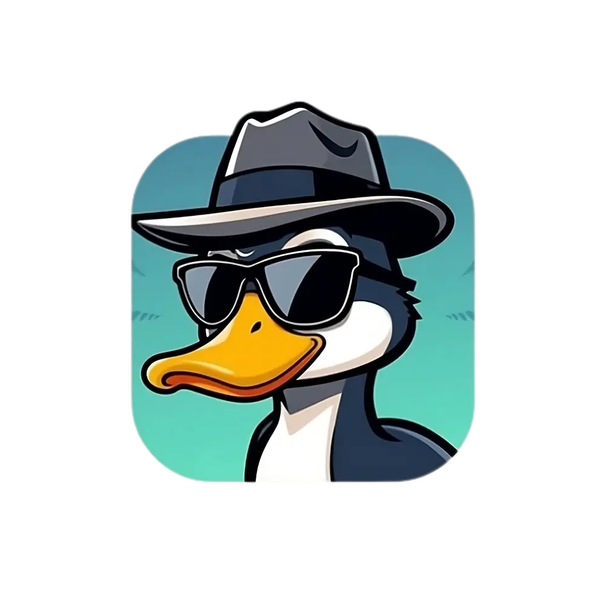

# DuckAlias Sender



DuckAlias Sender is a simple web application that allows users to generate DuckDuckGo email aliases and send emails through them. This app is built using **React**, **Chakra UI**, and **localStorage** to provide a smooth user experience. The app also supports dark mode.

## Features

- **Alias Generation**: Enter your DuckDuckGo email and the recipient's email to generate a masked alias.
- **Clipboard Copy**: Copy the generated alias to the clipboard with a single click.
- **Responsive Design**: Fully responsive and works well on both mobile and desktop.
- **Dark Mode Support**: Automatic adaptation based on the user's system color mode.
- **Local Storage**: Input values are saved locally, so you don't lose them when refreshing the page.

## Demo

You can view the live demo [here](https://duck-alias.techcrafter.online/).

## Installation

1. **Clone the repository**:

   ```bash
   git clone https://github.com/hadyrashwan/duckduckgo-sender-alias
   cd duckalias-sender
   ```

2. **Install the dependencies**:

   ```bash
   npm install
   ```

3. **Start the development server**:

   ```bash
   npm run dev
   ```

## Usage

1. Enter your DuckDuckGo email (e.g., `example@duck.com`).
2. Enter the recipient's email (e.g., `recipient@example.com`).
3. Click the **Generate Alias** button to create a masked alias (e.g., `recipient_at_example.com@example.duck.com`).
4. Click the **Copy** button to copy the alias to your clipboard.
5. Use the alias to send emails to your recipients while protecting your personal email address.

## Tech Stack

- **React**: Frontend JavaScript framework
- **Chakra UI**: UI framework for React
- **TypeScript**: Typed JavaScript for better code quality and developer experience
- **localStorage**: Used to persist user inputs across sessions
- **CSS Variables**: For dynamic styling and theme management

## Folder Structure

```bash
├── public
│   └── index.html            # Main HTML file
├── src
│   ├── assets                # Images and assets
│   ├── components            # Reusable components (if any)
│   ├── App.tsx               # Main app component
│   ├── App.css               # CSS styles
│   └── index.tsx             # React entry point
└── package.json              # Project dependencies and scripts
```

## Customization

You can customize the app’s theme and appearance by modifying the CSS variables in the `App.css` file.

```css
:root {
  --text-color: #1c4532;
  --box-bg-color: #f0fff4;
  --button-bg-color: #38a169;
  --button-text-color: white;
  --divider-color: #c6f6d5;
  --border-color: #38a169;
  --logo-hover-color: #646cffaa;
  --react-logo-hover-color: #61dafbaa;
}
```

## Contributing

Contributions are welcome! If you have suggestions or find any issues, feel free to create a pull request or open an issue.

## License

This project is open-source and available under the [MIT License](LICENSE).

## Acknowledgements

- **DuckDuckGo**: For their amazing email aliasing service.
- **Chakra UI**: For the beautiful and flexible UI components.
- **React**: For providing the foundation to build this app.
- **TypeScript**: For bringing type safety to JavaScript.
